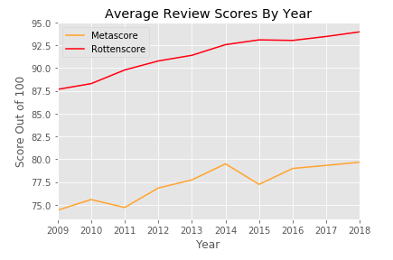
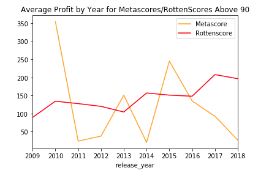
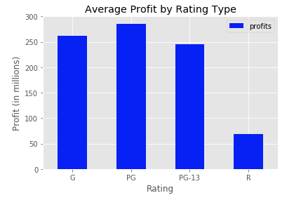
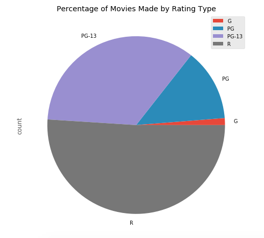

<b>Flatiron School Mod 1 Project</b> 
 
 
Contributors: Austin Krause and Ran Tokman  
Link to presentation slideshow: https://docs.google.com/presentation/d/1kgbR6-_efBxQQtMYtiyv-YSppf2fU431R0HFtjnoDbo/edit#slide=id.p 
 
<b>Project Goals:</b> 
  -scrape data from Rotten Tomatoes and use titles as a base dataframe 
  -use aspects of the scraped data to make API requests on IMDB, OMDB and TMDB 
  -find relationships within our data to describe what types of movies may return higher revenue/profits 
  -find insights within the data using Pandas and display that information using Seaborn, Matplotlib etc

<b>Questions to be answered:</b> 
  -Does Rotten Score or Metascore have an overall impact on profitability of a movie? 
  -Are there trends in profitibility based on movie ratings (G, PG, PG-13, R)?  
  -Does accessibility of seeing a movie bring higher profits? 
    
  
  
   
  Is there a discrepancy between Metascore and Rotten Score? Above shows the break down of the average difference between Metascore and Rotten Score per year.  
   
  Next we made a subset of our dataframe to only include movies that scored above 90 in either Metascore or Rotten Score. Shown by the graph, Metascore does not seem to be a reliable way of prediciting profitibility. We cannot say that Rotten Score can predict profitibility either, however, it shows to be a bit more consistent than Metascore.  
   
  What movie rating shows the highest average profits? To do this we grouped our dataset into the most popular movie categories (G, PG, PG-13, R) and found the mean profit for each grouping. According to our data, PG movies tend to profit the most, with G and PG-13 movies profitting strongly as well. This may speak to the accessibility of the movies. Rated R movies will exclude most of the younger population and could play a factor in that regard. Finally, we look at the break down of the each group.  
   
  To get a better look, we will need to incorporate more data in the future to even out the groupings.   
<b>Going forward:</b> 
  -Utilize data from that we scraped from BoxOfficeMojo 
  -Compare our findings with findings in the new data 
  -Expand range of movie years beyond 2009-2018 
